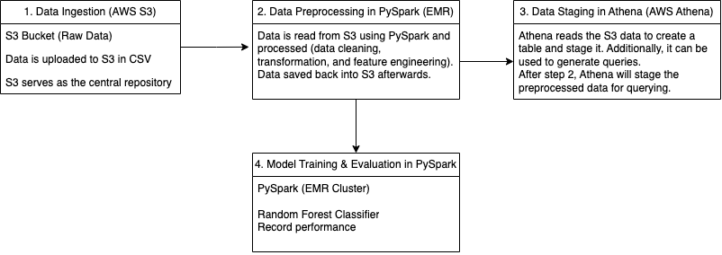
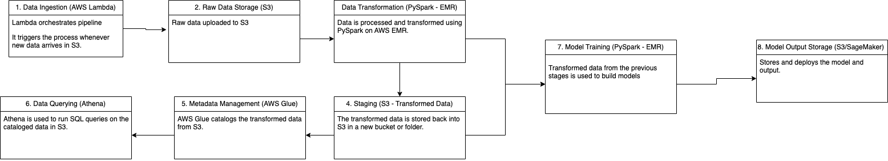

## Dataset

This dataset, card_transdata.csv, is a public Kaggle dataset of 1,000,000 card transactions with 8 features (such as distance from home, distance from last transaction, ratio to median purchase price, and whether a chip or PIN was used). It contains 87,403 fraudulent and 912,597 legitimate transactions.

## Python Code

- [View PySpark Pipeline Notebook](https://github.com/kvellian/fraud_detection_aws/blob/main/assets/path/pyspark-finalproject-kenvellian.ipynb)
- [View Athena Notebook](https://github.com/kvellian/fraud_detection_aws/blob/main/assets/path/athena-finalproject-kenvellian.ipynb)

AWS credentials are read from environment variables and are not included in this repository.

## Purpose

This project aims to build a fraud detection pipeline that runs on cloud infrastructure at the scale of a million transactions, using Spark for processing and machine learning and Athena for SQL queries.

## Architecture

- Stored the raw data in Amazon S3.
- Processed it with PySpark on a multi-node AWS EMR cluster.
- Engineered a distance ratio feature and assembled features with VectorAssembler.
- Wrote the transformed data back to S3 and created Athena tables with boto3 for SQL analysis.
- Trained a Spark MLlib Random Forest with 5-fold cross-validation, with and without class weighting to handle the 9% fraud rate.

The second diagram shows a proposed extension with scheduled runs; it was designed but not built.

## Results

| Model | AUC | Accuracy | Fraud Precision | Fraud Recall | Fraud F1 |
|---|---|---|---|---|---|
| Random Forest | 0.990 | 0.987 | 1.00 | 0.86 | 0.92 |
| Random Forest, class-weighted | 0.995 | 0.981 | 0.83 | 0.98 | 0.90 |

Class weighting **raised fraud recall from 86% to 98%**, catching far more fraud at the cost of more false alarms. For fraud detection, missing fraud is usually the costlier error, so the weighted model is the better fit.

## Notes

These metrics were computed on the full dataset rather than a separate held-out test set, so they likely overstate real-world performance. A held-out split is the next improvement.

Course: CSC 555 Mining Big Data, DePaul University (Fall 2024).
